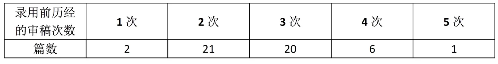
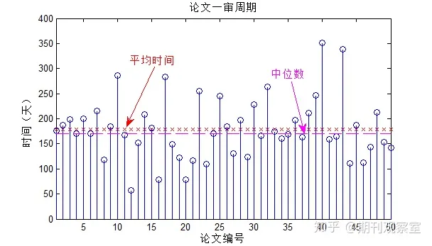
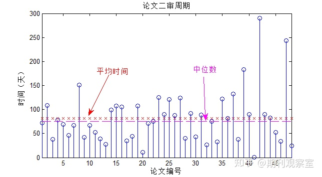
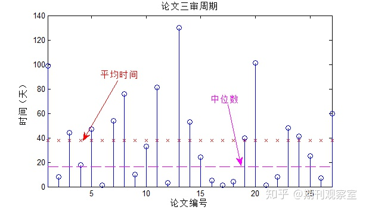
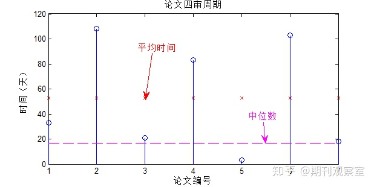

# 医学图像 期刊&会议&比赛 汇总：

影响因子（**Impact Factor**，**IF**）是 Thomson Reuters 出品的期刊引证报告（Journal Citation Reports, JCR）中的一项数据。 即某期刊前两年发表的论文在该报告年份中被引用总次数除以该期刊在这两年内发表的论文总数。

影响因子现已成为国际上通用的期刊评价指标，它不仅是一种测度期刊有用性和显示度的指标，而且也是测度期刊的学术水平，乃至论文质量的重要指标。影响因子是一个相对统计量。

一般来说影响因子高，期刊的影响力就越大。

## 期刊

| 刊物简称 |                           刊物全称                           |      出版社       |                             网址                             | CCF 分类 | SCI分区 |   IF   | 审稿周期 |
| :------: | :----------------------------------------------------------: | :---------------: | :----------------------------------------------------------: | :------: | :-----: | :----: | :------: |
|   TIP    |        [IEEE Transactions on Image Processing](#tip)         |       IEEE        |       [tip](http://dblp.uni-trier.de/db/journals/tip/)       |  CCF-A   |   Q1    | 12.762 |   8.1    |
|   IJCV   |      [International Journal of Computer Vision](#ijcv)       |     Springer      |     [ijcv](https://dblp.uni-trier.de/db/journals/ijcv/)      |  CCF-A   |   Q1    | 11.478 |    2     |
|   TMI    |         [IEEE Transactions on Medical Imaging](#tmi)         |       IEEE        |      [tmi](https://dblp.uni-trier.de/db/journals/tmi/)       |  CCF-B   |   Q1    | 12.369 |   2.75   |
|  JAMIA   | [Journal of the American Medical Informatics Association](#jamia) |   BMJ Journals    |    [jamia](http://dblp.uni-trier.de/db/journals/jamia/ )     |  CCF-B   |   Q1    | 7.041  |    ——    |
|   MIA    |                [Medical Image Analysis](#mia)                |     Elsevier      |      [mia](https://dblp.uni-trier.de/db/journals/mia/)       |  CCF-C   |   Q1    | 14.934 |    3     |
|   JBHI   |  [IEEE Journal of Biomedical and Health Informatics](#jbhi)  |       IEEE        |     [titb](https://dblp.uni-trier.de/db/journals/titb/)      |  CCF-C   |   Q1    |  6.98  |   2.75   |
|   JBI    |          [Journal of Biomedical Informatics](#jbi)           |     Elsevier      |      [jbi](https://dblp.uni-trier.de/db/journals/jbi/ )      |  CCF-C   |   Q1    | 6.359  |    ——    |
|   NBE    |            [Nature Biomedical Engineering](#nbe)             | Nature Po rtfolio |         [nbe](https://www.nature.com/natbiomedeng/)          |    ——    |   Q1    | 31.072 |    6     |
|  TPAMI   | [IEEE Transactions on Pattern Analysis and Machine Intelligence](#tpami) |       IEEE        | [tpami](https://ieeexplore.ieee.org/xpl/RecentIssue.jsp?punumber=34) |    ——    |   Q1    | 25.651 |  7.875   |
|   CMPB   |    [Computer Methods and Programs in Biomedicine](#cmpb)     |     Elsevier      |      [cmpb](https://dblp.uni-trier.de/db/journals/cmpb)      |    ——    |   Q1    | 6.521  |   6.56   |
|   CMIG   |      [Computerized Medical Imaging and Graphics](#cmig)      |     Pergamon      |      [cmig](https://dblp.uni-trier.de/db/journals/cmig)      |    ——    |   Q1    | 6.141  |    1     |
|   CBM    |          [Computers in Biology and Medicine](#cbm)           |     Pergamon      |       [cbm](https://dblp.uni-trier.de/db/journals/cbm)       |    ——    |   Q1    | 5.752  |   3.43   |
|   TBE    |     [IEEE Transactions on Biomedical Engineering](#tbe)      |       IEEE        |       [tbe](https://dblp.uni-trier.de/db/journals/tbe)       |    ——    |   Q2    | 5.674  |    1     |
|   BSPC   |      [Biomedical Signal Processing and Control](#bspc )      |     Elsevier      | [bspc](https://dblp.uni-trier.de/db/journals/bspc/index.html) |    ——    |   Q2    | 4.957  |    ——    |
|    MP    |                    [Medical Pyhsics](#mp)                    |       Wiley       | [mp](https://aapm.onlinelibrary.wiley.com/journal/24734209#) |    ——    |   Q2    | 4.354  |   1.71   |
|   MRM    |            [Magnetic Resonance in Medicine](#mrm)            |       Wiley       |   [mrm](https://onlinelibrary.wiley.com/journal/15222594)    |    ——    |   Q2    | 4.108  |    2     |
|  ACCESS  |                    [IEEE Access](#access)                    |       IEEE        | [access](https://dblp.uni-trier.de/db/journals/access/index.html) |    ——    |   Q2    | 3.758  |   2.36   |
|   MTA    |          [Multimedia Tools and Applications](#mta)           |     Springer      | [mta](https://dblp.uni-trier.de/db/journals/mta/index.html)  |    ——    |   Q3    | 2.395  |    6     |

## 会议

| 会议简称 |                           会议全称                           |                           网址                            | CCF分类 |             投稿日期             |
| :------: | :----------------------------------------------------------: | :-------------------------------------------------------: | :-----: | :------------------------------: |
|   CVPR   | [IEEE Conference on Computer Vision and Pattern Recognition](#cvpr) |      [cvpr](http://dblp.uni-trier.de/db/conf/cvpr/)       |  CCF-A  |       每年11月初-11月中旬        |
|   ICCV   |     [International Conference on Computer Vision](#iccv)     |      [iccv](http://dblp.uni-trier.de/db/conf/iccv/)       |  CCF-A  |        每年3月初-3月中旬         |
|   ICML   |    [International Conference on Machine Learning](#icml)     |      [icml](http://dblp.uni-trier.de/db/conf/icml/)       |  CCF-A  |       每年1月中旬-1月下旬        |
|  MICCAI  | [International Conference on Medical Image Computing and Computer-Assisted Intervention](#miccai) |    [miccai](https://dblp.uni-trier.de/db/conf/miccai)     |  CCF-B  |       每年2月中下旬-3月初        |
|   ISBI   | [IEEE International Symposium on Biomedical Imaging](#isbi)  |      [isbi](https://dblp.uni-trier.de/db/conf/isbi)       |  CCF-C  |   每年的10月截稿，次年4月开会    |
|   MIDL   | [International Conference on Medical Imaging with Deep Learning](#midl) |      [midl](https://dblp.uni-trier.de/db/conf/midl)       |   ——    | 每年的1月底左右截稿，次年7月开会 |
|   SPIE   |                [SPIE Medical Imaging](#spie)                 |     [spie](https://dblp.uni-trier.de/db/conf/spiemi)      |  CCF-C  |       8月截稿，次年2月开会       |
|   IPMI   |      [Information Processing in Medical Imaging](#ipmi)      | [ipmi](https://dblp.uni-trier.de/db/conf/ipmi/index.html) |   ——    |          2021年六月下旬          |
|   ICIP   |  [IEEE International Conference on Image Processing](#icip)  | [icip](https://dblp.uni-trier.de/db/conf/icip/index.html) |  CCF-C  |    每年1月或2月截稿，9月开会     |
|   AMIA   | [American Medical Informatics Association Annual Symposium](#amia) |      [amia](http://dblp.uni-trier.de/db/conf/amia/ )      |  CCF-C  |        2023年11月11-15日         |

## 期刊详细介绍

### TIP

IEEE Transactions on Image Processing （TIP）涵盖图像、视频和多维信号的形成、捕获、处理、通信、分析和显示的新理论、算法和体系结构。主题包括但不限于数学、统计和感知建模、表示、形成、编码、滤波、增强、恢复、呈现、半色调、搜索和分析图像、视频和多维信号。应用包括图像和视频通信、电子成像、生物医学成像、图像和视频系统以及遥感。目前是中科院分区1区Top期刊。

该刊已被国际权威数据库SCI、SCIE收录，是国际顶级期刊。该刊致力于发表经过严格同行评审的高质量原创文章，反映工程技术-工程：电子与电气领域的新进展、新技术、新成果，促进该领域科研交流和科研成果转化。该刊2021年影响因子为11.041，平均审稿速度为约8.1个月，近三年来没有被列入预警名单。

**审稿周期统计**

从2020年所发表的论文中随机抽样50篇论文，统计论文录用前所历经的审稿次数如下。

**1、一审周期**

统计所有论文的一审周期，最短、最长分别为57天、351天时间，如下图所示。基于平均数、中位数的一审统计周期分别为179、170天，由此可见：此刊的**一审平均周期需要6个月时间**。

基于所有样本的一审周期，拟合一周周期概率分布图，可以得到结果：**接近60%的论文能在190天内收到一审结果及完成返修**。

**2、二审周期**

统计48篇历经二审论文的二审周期，如下图所示。最短、最长二审时间分别为1天、290天，两级分化较严重。基于平均数、中位数的二审统计周期分别为82天、75天。由此可见：**二审平均周期需要2.5个月的时间**。

**3、三审周期**

对27篇历经三审的论文，统计三审周期，最短、最长审稿时间分别为1天、130天。基于平均数、中位数的统计三审周期分别为38天、17天时间。由此可见：**三审平均周期约1个月**。

**4、四审、五审周期**

针对7篇历经四审的论文，统计四审周期如下图：最短、最长周期分别为3天、108天。基于平均数、中位数的统计四审周期分别为53天、17天时间。

对于历经五审的1篇论文，其审稿周期相对较短，只历经了5天时间即被录用。

总体来说，此刊的录用周期非常长。

**投稿经历**

论文初步上传后，有一个月时间的quality check过程，主要是对研究方向是否符合期刊、英文写作是否达到水平进行检查，这个过程估计是AE和ADM(期刊编辑)共同完成，论文的状态在此时也会进入 “under review”,但只是quality check阶段。 我的论文这个过程大致花了2周时间。

如果过了quality check（如果没过，会直接返回，和IEEE SIGNAL PROCESSING LETTERS类似），论文正式进入审稿阶段，在7月初，审稿经历了约4个月，收到了一审意见Major Revision（RQ）,三个审稿人给了2个RQ,一个AQ,两个RQ的审稿人主要对论文组织结构提出了问题，这个主要是我的算法包含了好几个创新点，写的时候没能突出重点，公式推导有点长；但是三个审稿人对论文的创新性都进行了肯定。由于这篇论文，我的外导曾经极力推荐投PAMI（我自己觉得投PAMI有点悬，而且听说时间更长），我对这篇论文投TIP还是很有信心的，打算修改，继续TIP。

一审返修，TIP给1个月的修改时间，针对审稿人的意见进行了详细的修改，特别是重新调整的行文结构，对公式推导进行了简化，按照审稿人意见增加了实验。这个工作量非常紧，于是中间外导让申请增加一个月的修改时间。期刊的编辑很nice，同意了我的申请。申请的时候，一定要说明为什么要延长的原因，比如修改的需要重新行文、增加大量实验等有说服力的理由。最后在8月底修回。

在10月初，经历月1个月，得到二审意见AQ，这次三个审稿人的意见：2个A, 1个AQ。给AQ的审稿人的意见在于对算法的参数讨论还不够。之前我对算法中最关键的参数进行了很详细的讨论，对于其他一些参数，简略的说了一下，审稿人要求对这部分参数还需讨论一波。

这次给了2周的返修时间,主要解决其他参数讨论的问题，这个问题做过算法的童鞋应该清楚，问题很简单，工作量很大，要额外做很多实验，而且论文的篇幅也太长了。于是做出了2个解决方案，一个是申请延长2周的时间，另外一个是不在正文中做特别详细的参数讨论，但是在回复中，把实验结果告知审稿人。

在11月初修回后，第二天就收到了Accept的通知，比较开心，对得起博士这个头衔了!

总结一下整个过程，审稿花费约6个月，修改2个多月，总计8个多月左右，还是很漫长的一个过程。

### IJCV

主要内容包括：

数学，物理，计算机视觉计算方面：图像的形成，处理，分析和解释;机器学习方法，统计方法，传感器。

应用：基于图像的绘制，计算机图形学，机器人，照片判读，图像检索，视频分析和注释，多媒体等。

人类认知相关联：人类视觉方面的计算与架构。

该杂志还设有书评，建议书，社论，领先的科学数据，以及在线的材料，如静止图像，视频，数据集和软件。

**投稿经历 1**

12月24日投初稿；2月28日返回初审结果：major revision。

3月28日投修订稿，6月12日通知录用。

**投稿经历 2**

一共将近六个月。初审2个多月，大修，改完小修，小修完20天出结果。ijcv是很好的期刊，发文量比较少。希望ijcv越办越好。

### TMI

《IEEE Transactions on Medical Imaging》是医学、生物学、影像学及计算机科学类期刊，收录有关身体结构、形态和功能成像的研究，包括细胞和分子成像以及所有形式的显微镜检查。

该期刊发表超声，X线，磁共振，放射性核素、微波和光学方法等医学影像的原创性研究，也非常欢迎新型采集技术、医学图像处理和分析、可视化和性能、模式识别、机器学习以及相关方法等研究的投稿。

**审稿周期**

5月29日投稿，8月17日接受，从投稿到接受共2个多月。

4月28日投稿，5月12日接受，从投稿到接受共2周。

4月27日投稿，5月10日接受，从投稿到接受共2周。

审稿速度很快，从投稿到接受快的只要2周。

**版面费**

非OA期刊，免版面费。

**投稿经历**

6月份刚中过一篇，算是比较幸运，**投稿20天左右出了审稿意见**，小修，**修改后一周就接收了。**感觉侧重算法，实验要充分，文章不要出现大的逻辑错误。

### JAMIA

无

### MIA

- MIA是领域的顶刊，基于这些统计能知道国际、国内的顶尖研究团队和大牛学者。
- MIA是双月刊，发文量不多。返回第一轮审稿意见在4个月左右。
- 顶刊每年的发文量一般波动不大。
- 高被引论文是初入门的同学值得重点阅读的文章。
- 国内参与的论文数量近三年在稳步提升。
- 中科院升级版分区把该期刊划分到了工程技术领域。
- 以上统计的不足是存在重复。比如国内参与的127篇文章里，很多论文的通讯作者是国外学者。如果系统能提供只基于通讯作者的论文统计，会更方便的看出国内的发文量。

### JBHI

投稿命中率：95.0%

**投稿经历**

17年12月初投稿，18年1月底出审稿结果,大修。之前投tbme被拒后修改改投，3个审稿人，这点比tbme要求高，后者只有2个。3个里面一个应该是推荐审稿人，还好。第二个审稿人绝对的小同行中的小同行，层主做配准的，审稿人问的简直怀疑人生，补了一大堆实验，释疑，最后还要传源码。第三个应该是偏临床的，主要集中在数据来源和临床意义上的问题。18年4月初返稿，五月初直接接受。整体来说，对算法创新性和实验结果要求较高，对文章语言和格式什么的要求不是很高，第三个审稿人要求修改语言，老板为了省钱组内改了一下，不过后来也没太究这个。格式最后编辑排版的时候会适当修改，这个还是很nice的！

### TPAMI

TPAMI是由IEEE计算机学会出版的月度同行评审科学期刊。它涵盖了计算机视觉和图像理解，模式分析和识别以及机器智能的研究。机器学习，搜索技术，文档和手写分析，医学图像分析，视频和图像序列分析，基于内容的图像和视频检索，以及面部和手势识别等。
顶刊，难。

### JBI

**投稿经历**

2019年11月19投出。
2020年1月24外审。
2020年3月13通知大修。
2020年4月1号逐条答复修改意见并提交大修到系统。
2020年4月25号收到录用通知。

4.1. 投
5.12. major revision 6.11. 改好
7.12. minor revision 7.18. 改好
8.25. major revision 9.5. 改好
10.11. accept

### NBE

**期刊信息**

Nature Biomedical Engineering是一个在线出版的月刊，于2017年1月创刊，主要发表对生物医学工程领域有重大影响的原创研究、综述和评论。该期刊涵盖了从基础科学到临床应用的各个方面，包括生物材料、医学器械、生物信号处理、分子影像、组织工程等。该期刊的编辑部位于伦敦，由主编Rita Strack和副主编Alberto Moscatelli领导。该期刊的影响因子为18.952（2020年），中科院JCR分区为一区（2020年） 

**投稿要求**

在初次投稿之前，需要确保Nature Biomedical Engineering是最适合你的工作的期刊，同时检查你的稿件是否符合期刊的目标和范围。你需要通过在线系统提交你的稿件，并提供以下内容：封面信、文章标题、作者列表、摘要、正文（不超过3000字）、参考文献（不超过50条）、图表和图例（不超过6个）、补充材料（可选）等。你需要遵守期刊的出版伦理规范，包括声明利益冲突、获取伦理批准、使用统一资源标识符（DOI）等。你需要注意期刊对文章格式和风格的要求，包括使用英语写作、使用国际单位制（SI）、使用正确的缩写和术语等。

**审稿周期**

该期刊的审稿周期平均为6个月

该期刊的投稿命中率为0.0%

该期刊的编辑决定是否送审的时间中位数为3天

该期刊的审稿人意见返回的时间中位数为85天

该期刊的最终接收时间中位数为153天

### CMPB

AI 医学图像分析容易中

**投稿经历**

经验分享：审稿人不专业

并不仔细阅读文章内容就提出审稿意见，对已有内容视而不见

审稿或带有个人倾向，意见吹毛求疵程度令人恶寒

编辑不规范操作

初审四位审稿人，三修时二外增加俩位，而此时前四位审稿人依然都推荐通过

如今四修，前途未卜，建议大家慎重

### CMIG

### CBM

**投稿经历**

偏重的研究方向：医学临床数据;数据挖掘
经验分享：一审5个审稿人，几十个审稿意见，但是非常仔细和严谨，返修后半个月二审，因为一个审稿人还是要求补实验，所以又返修，但是返修后给找了另一个审稿人6，又有一部分意见，返修后，直接接收。杂志编辑相当认真，尤其是审稿人，标点符号、语法等全部都能指出，现在即使影响因子6.133，Q1区，感觉非常不错，强烈推荐！！！

### TBE

审稿人只有两个，相对较容易。

**期刊信息**

IEEE Transactions on Biomedical Engineering (TBME)是IEEE医学和生物学工程学会（IEEE Engineering in Medicine and Biology Society, EMBS）出版的一本汇刊，包含有关生物医学工程的基础和应用论文。论文范围从具有生物医学应用的方法和技术的工程开发到具有工程贡献的实验和临床研究。tbe期刊的影响因子（2020年）是5.439，在生物医学工程类期刊中排名第7/87，在工程类期刊中排名第19/266。

**投稿要求**

tbe期刊的投稿要求包括：文章长度不超过8页（含参考文献和图表），使用双栏格式和IEEE模板，提供摘要、关键词、引言、方法、结果、讨论、结论等部分，遵循IEEE出版伦理规范等。

**审稿周期**

tbe期刊的审稿周期平均为1个月，投稿命中率为50%，自引率为4.1%，但也有可能因为编辑和审稿人的工作量、专业度、反馈速度等因素而有所不同。

tbe期刊的审稿过程一般包括：投稿后1-2个工作日内收到确认邮件，然后由编辑分配给合适的审稿人，审稿人在约15个工作日内给出初步意见，编辑根据意见决定是否接收、拒绝或修改，并通知作者。

tbe期刊的修改要求一般分为：小修（minor revision）、中修（moderate revision）和大修（major revision），修改时间一般为1-3个月，修改后再次提交后还需经过编辑和审稿人的复核。

### MP

**期刊信息**

老牌期刊，美国人中的文章非常多，对创新的要求不是特别高，偏向临床意义，审稿人只有两个，相对较易，适合急着毕业的童鞋。

Medical Physics是医学物理学领域的权威期刊，成立于1974年，是美国医学物理学家协会（AAPM）、加拿大医学物理学组织、加拿大医学物理学院和国际医学物理学组织（IOMP）的官方科学期刊。Medical Physics的影响因子（2020年）是3.319，在放射学、核医学和医学影像类期刊中排名第34/136，在工程类期刊中排名第49/273。根据2020年的数据，Medical Physics期刊在中科院SCI分区中属于**二区**（工程技术类），在JCR SCI分区中属于**Q2**（工程类）。

**投稿要求**

Medical Physics的投稿要求包括：文章长度不超过10页（含参考文献和图表），使用双栏格式和Wiley模板，提供摘要、关键词、引言、方法、结果、讨论、结论等部分，遵循AAPM出版伦理规范等。

**审稿周期**

Medical Physics的审稿周期平均为1.71个月，投稿命中率为56.67%，自引率为18.4%。

### MRM

**期刊信息**

《Magnetic Resonance In Medicine》是一本由WILEY出版商出版的专业医学期刊，该刊创刊于1984年，每月出版一期，主要涉及核磁共振和电子顺磁共振技术在医学应用方面的原创研究。该刊的影响因子为4.085，中科院分区为二区。该刊的投稿命中率为25.0%，自引率为23.7%。

**投稿要求**

投稿前需要注册一个Wiley Online Library账号，并通过ScholarOne Manuscripts系统提交论文。

投稿时需要提供论文标题、作者姓名和联系方式、摘要、关键词、正文、参考文献等内容，以及封面信和版权转让协议。

投稿的论文必须是原创的，没有在其他期刊或会议发表过或正在审稿中的，也没有抄袭或剽窃他人的成果。

投稿的论文必须符合期刊的主题和范围，即与核磁共振和电子顺磁共振技术在医学应用方面有关的原创研究。

投稿的论文必须遵循期刊的格式和风格要求，例如字体、字号、行距、页边距、图表、公式等。具体要求可以参考期刊网站上的 Author Guidelines。

### ACCESS

**投稿经历**

经验分享：5.5投的稿，6.5就有结果了，两个accept。可惜的是现在变成三区了

经验分享：最开始是12月中旬投的twc，直到今年3月29号才出一审结果，历时四个半月（其实一月中旬就分配了审稿人），直接拒稿，审稿人和编辑认为更适合发表在会议上，需要进一步的实验验证，但是给的建议一般，不太有用，感觉没有get到我的意思；
后面想如果还投这种审稿周期这么长的期刊，估计就毕不了业了，论文又无法压缩到会议限制的长度，因此选择投这个期刊。
4月14日投出去，5月13日收到一审意见，两个重投一个接受，总共3 13 3条审稿意见，后面两个审稿人给的意见都很有用，感觉比twc返回的意见有用的多，按照意见补充了很多实验，6月2日重投，6月13日收到接收邮件，拒稿的审稿人说问题都解决了。
如果不是要毕业，如果不是这些传统期刊审稿周期太长，谁又愿意投评价这么低的期刊呢？

### MTA

**投稿经历**

经验分享：19年4月投稿，10月一审结果大修，12月二审结果小修，3月录用，历时11个月。我写的文章质量一般，这个期刊审稿速度慢，门槛相对较低，比较容易录用，适合初学者或第一篇sci。着急毕业用的，不建议投。

经验分享：这个期刊审稿速度非常慢，投稿了五个月，状态是editor assigned,然后给期刊发邮件，撤稿了，很坑的一个期刊，巨慢无比。

经验分享：19年5月投稿，12月一审，20年3月份接收。这个期刊难度不大，容易中。不介意耗时太长的可以考虑。

### BSPC

**投稿经历**

经验分享：论文内容属信号理论在医学图像处理应用。感觉原创性论文好发一些，而且需要实验数据及分析，尽量细致一些。一审接近4个月，结果为临时接受。中间修改二十多天，返回修改稿正赶上圣诞节，中间耽搁10天左右。复审近1个月后接受。 对审稿人问题回答的尽量详细，消除其疑问。论文接受后，一个月内就在线出版了。

经验分享：2019.2.20投稿 2019.10.10给一审意见等的我好苦，中间催稿三次 2019.11.16返回意见 2019.11.23送审 2019.12.08接受

经验分享：论文一审将近5个半月，结果为临时接受。二审2个月零10天，录用。

## 会议详细介绍

### CVPR

**投稿时间**

CVPR 2022的论文提交截止日期是**2021年11月18日**（太平洋时间上午11:59）。每篇论文都应该在一周前，即**2021年11月9日**（太平洋时间晚上11:59）之前注册。补充材料可以在**2021年11月24日**（太平洋时间上午9:59）之前提交。

CVPR每年的论文提交截止日期大约是11月中旬，而论文注册截止日期大约是11月初。补充材料的提交截止日期大约是11月下旬。具体的日期可能会有一些变化，所以建议及时关注CVPR官网。

**会议信息**

CVPR是一个年度的计算机视觉和模式识别会议，被认为是该领域最重要的会议之一。根据Google Scholar Metrics (2022)，它是影响力最高的计算机科学会议。CVPR每年包括主会议和一些卫星工作坊和短期课程，为学生、学者和行业研究人员提供了高质量和低成本的学习交流机会。CVPR 2022将于2022年6月19日至24日在美国新奥尔良举行。

### ICCV

**投稿时间**

ICCV每年的论文提交截止日期大约是3月中旬，而论文注册截止日期大约是3月初。补充材料的提交截止日期大约是3月下旬。具体的日期可能会有一些变化，所以建议及时关注ICCV官网。ICCV 2021的最终论文提交截止日期是2021年8月17日。

**会议信息**

ICCV是一个国际性的计算机视觉会议，包括主会议和一些卫星工作坊和教程。它以高质量和低成本为学生、学者和行业研究人员提供了极好的学习交流机会。ICCV每两年举行一次，通常在10月进行。ICCV 2021将于2021年10月11日至17日在线上举行，而ICCV 2023将于2023年10月2日至6日在法国巴黎举行。

### ICML

**投稿时间**

ICML每年的论文提交截止日期大约是1月下旬，而论文摘要提交截止日期大约是1月中旬。具体的日期可能会有一些变化，所以建议及时关注ICML官网]。ICML 2023的论文提交截止日期是2023年1月26日。

**会议信息**

ICML是一个国际性的机器学习会议，包括主会议和一些卫星工作坊和教程]。它以高质量和低成本为学生、学者和行业研究人员提供了极好的学习交流机会。ICML每年举行一次，通常在7月进行。ICML 2023将于2023年7月23日至29日在美国夏威夷举行。

### MICCAI

投稿时间：大多是2月中下旬-3月初，9/10月开会

MICCAI 2023 论文提交系统开放时间：2023年1月10日

提交意向：2023年2月23日

论文全文提交：2023年3月9日

最终决定通知：2023年6月23日

 会议信息：医学图像处理领域最受大家认可的会议，在分割领域具有深远影响的UNet就是在2015年发表在MICCAI上的。

### ISBI

ISBI 2022的投稿日期是2022年1月3日，但是必须在2021年11月8日之前提交最终版本，否则将无法参加会议。ISBI 2023的投稿日期还没有公布，但是根据以往的经验,一般是在10月底左右。

会议信息：IEEE国际生物医学成像研讨会（ISBI）是一个科学会议，致力于生物和生物医学成像的数学，算法和计算方面，涵盖所有观察规模。

相对于MICCAI来说容易中一些，但是认可度也很高。

### MIDL

**MIDL 2023**

论文注册截止日期：2023.1.8

论文提交截止日期：2023.1.15

审查到期：2023.2.3

反驳：2023.2.7-17

最后决定：2023.2.24-3.2

**短篇论文**

论文提交截止日：2023.4.7

最后决定：2023.4.28

会议信息：该会议从2018年开始举办，但是大家对该会议的评价还是蛮高的，论文质量也不错。非常年轻的会议，文章open review，能看到审稿人的意见和作者的回复。可能因为才举办没多久，会议的影响因子比较低。Attention-UNet就是发表在MIDL 2018上。MIDL是基于深度学习的医学图像分析领域的新兴国际会议之一，目前还没有CCF分类

### SPIE

SPIE举办的系列会议，七个SPIE会议相对容易，EI收录慢，论文10个月才出版。

SPIE Medical Imaging 2023的投稿日期是2022年8月10日，但是必须在2022年12月19日开始提交你的论文和海报。SPIE Medical Imaging 2024的投稿日期还没有公布，但是根据以往的经验,一般是在8月中旬左右。

会议信息：SPIE举办的系列会议，相对容易

SPIE Medical Imaging是医学成像领域的重要国际会议之一，SPIE期刊 ——所有期刊被JCR收录，期刊的影响因子排名光学核心期刊的前列。

### IPMI

**投稿时间**

根据网上的信息，最近一届IPMI会议是在2021年6月28日至30日在线上举行的，原本计划在丹麦的Bornholm举行，但因为COVID-19疫情而改为虚拟形式。该届会议共收录了69篇全文论文，从229篇提交中精选而出。下一届IPMI会议预计将在2023年举行，具体时间和地点尚未公布。

 **会议信息**

Information Processing in Medical Imaging (IPMI)是一个每两年举行一次的会议，医学图像处理领域最古老的会议之一，主要关注应用数学、计算机科学、图像处理和图像分析（特别是医学图像）等领域。该会议也经常考虑神经科学、心脏病学和显微镜等应用领域的成果。IPMI会议非常重视高质量的论文提交和审稿过程，以及促进与会者之间的交流和讨论。

## **一区**

| 期刊名                                                       | 备注                       |
| ------------------------------------------------------------ | -------------------------- |
| IEEE Transactions on Pattern Analysis and Machine Intelligence | PAMI（偏应用）             |
| IEEE Transactions on Image Processing                        | TIP                        |
| IEEE transactions on Signal Processing                       | TSP                        |
| IEEE transactions on Medical Imaging                         |                            |
| Journal of Machine Learning Research                         | 理论                       |
| Physics in Medicine and Biology                              |                            |
| IEEE Transactions on Information Technology in Biomedicine   |                            |
| European Radiology                                           |                            |
| Applied Soft Computing                                       | 直接拒稿较少、周期长       |
| Information Fusion                                           | 编辑认真                   |
| Information Sciences                                         | 语言要求极高/很慢/期刊不错 |
| Computer Graphics Forum                                      |                            |
| Image and Vision Computing                                   | Q1/Q2                      |
| Neuroinformatics                                             | Q1/Q2                      |
| PloS ONE                                                     |                            |
| Neural Networks                                              |                            |
| IEEE Transactions on Cybernetics                             |                            |
| IEEE transactions on neural networks                         |                            |
| Pattern Recognition                                          |                            |

## **二区**

| 期刊名                                                       | 备注                                                         |
| ------------------------------------------------------------ | ------------------------------------------------------------ |
| Applied Soft Computing                                       |                                                              |
| Expert systems with application                              |                                                              |
| IEEE Transactions on Multimedia                              |                                                              |
| IEEE Transactions on Circuits and Systems for Video Technology |                                                              |
| Computer Vision and Image Understanding                      |                                                              |
| IEEE Transactions on Biomedical Engineering                  |                                                              |
| IEEE Transactions on Systems Man and Cybernetics Part B- Cybernetics |                                                              |
| IEEE Transactions on Information Theory                      |                                                              |
| Journal of Machine Learning Research                         |                                                              |
| Neurocomputing                                               |                                                              |
| Physics in Medicine and Biology                              |                                                              |
| IEEE Journal of Biomedical and Health Informatics            | Q2/Q3                                                        |
| Pattern Recognition Letters                                  | 慢                                                           |
| Artificial Intelligence in Medicine                          |                                                              |
| International Journal of Imaging Systems and Technology      | Q2/Q3                                                        |
| Machine Vision and Applications                              | 慢/范围较广Q2/Q3                                             |
| Acta Radiologica                                             | covers all aspects of radiology, from clinical radiology to experimental work |
| Computerized Medical Imaging and Graphics                    |                                                              |

## **三区**

| 期刊名                                                       | 备注 |
| ------------------------------------------------------------ | ---- |
| International Journal of Computer Assisted Radiology and Surgery |      |
| BioMedical Engineering OnLine                                |      |
| Soft Computing                                               | 慢   |
| Machine Vision and Applications                              |      |
| IEEE Computer Graphics and Applications                      |      |
| Signal Processing-Image Communication                        |      |
| Signal Processing                                            |      |
| Journal of Visual Communication and Image Representation     |      |
| Image and Vision Computing                                   |      |
| IET Computer Vision                                          |      |
| IET Image Processing                                         |      |
| IET Signal Processing                                        |      |
| IEEE Computer Graphics and Applications                      |      |
| COMPUTERIZED MEDICAL IMAGING AND GRAPHICS                    |      |

## **四区**

| 期刊名                                                       | 备注   |
| ------------------------------------------------------------ | ------ |
| OPTIK                                                        | 好中   |
| International Journal of Computational Intelligence Systems  |        |
| IEEE Signal Processing Letters                               |        |
| Optical Engineering                                          |        |
| Biomedical Signal Processing and Control                     |        |
| Computer Methods and Programs in Biomedicine                 |        |
| Signal Image and Video Processing                            |        |
| Journal of Electronic Imaging                                |        |
| Journal of Mathematical Imaging and Vision                   |        |
| Journal of Biomedical Science                                |        |
| International Journal of Pattern Recognition and Artificial Intelligence | 超慢   |
| Journal of Medical and Biological Engineering                |        |
| Signal Processing                                            |        |
| Machine Vision and Applications                              |        |
| Journal of Electronic Imaging                                | 入门用 |
| IRBM                                                         |        |
| International Journal of Pattern Recognition and Artificial Intelligence | 慢     |
| Journal of Digital Imaging                                   |        |
| Bio-Medical Materials and Engineering                        |        |
| JOURNAL OF INTERNATIONAL MEDICAL RESEARCH                    |        |
| European Journal of Radiology                                |        |
| Australasian Physical &amp; Engineering Sciences in Medicine |        |
| Peptides                                                     |        |
| Mol Divers                                                   |        |
| IFAC Journal of Systems &amp; Control                        |        |

